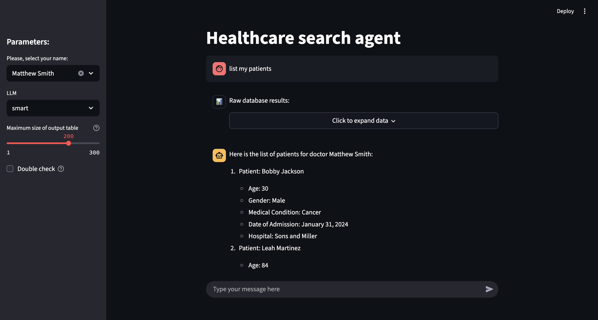

# Agentic Table Search

Healthcare search agent with natural language query interface powered by LLM and SQL generation.

TL;DR:
- Simple single streamlit app
- Here is chat agent that has conversation with a user and a tool, where tool is another agent that has access to the "database" and ability to query it.
- Database agent query pandas dataframe using pandasql and generated sql based on nlq
- Conversation is persisted only in session_state

## UI


## Comments

- This is the final state before task submission, in case of updates they will be placed in "further_improvements" branch.
- Most of my decisions described in comments in the code
- In general main decision maker here is 4 days timeframe
    - it would be great to have docker-compose with database, FastAPI backend, streamlit as containers, but it is what it is
    - it would be great to have more sophisticated LLM pipeline, but debugging of such systems (even in the current state) is very time consuming
    - etc.

## Setup & Installation

1. Clone the repo
2. Install dependencies
   ```bash
   pip install -e .
   pip install -r requirements.txt
   ```
3. Setup env variables
   
   Create a `.env` file in the project root:
   ```bash
   # Required
   OPENAI_API_KEY=your_openai_api_key_here
   
   # Optional (with defaults)
   DATA_PATH=data/processed/healthcare_dataset.csv
   CHAT_MODEL_NAME=gpt-4o
   LLM_RETRIES=3
   LOG_LEVEL=info
   ```

4. Prepare your data
    - download csv from [here](https://www.kaggle.com/datasets/prasad22/healthcare-dataset/data)
    - process you csv using notebooks/data_processing.ipynb
    - place your processed file in default `DATA_PATH` (`data/processed/healthcare_dataset.csv`) or change `DATA_PATH` value in .env

## Running the Application

```bash
streamlit run ui.py
```

The application will be available at `http://localhost:8501`

## Troubleshooting

Application logs are available in `app.log` file.

